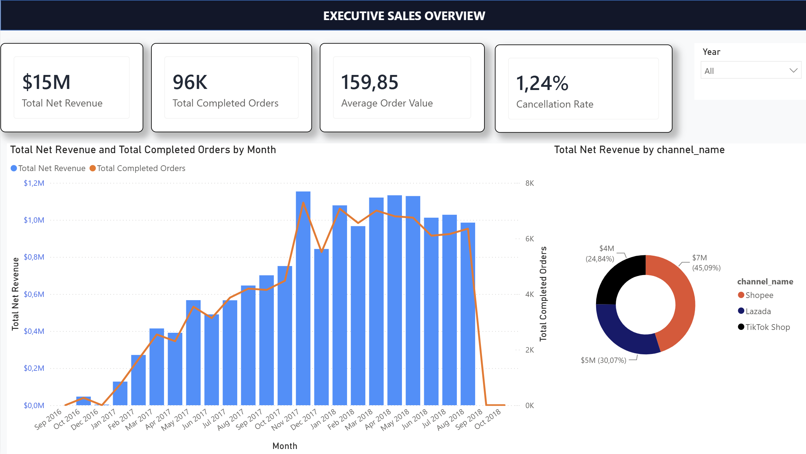
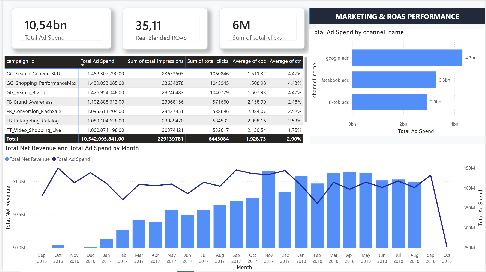

# E-Commerce Unified Analytics Pipeline

Pipeline local end-to-end hợp nhất dữ liệu đơn hàng đa kênh (Shopee, Lazada, TikTok Shop) và chi phí quảng cáo vào PostgreSQL. MinIO đóng vai trò Bronze data lake, Airflow điều phối pipeline, dbt tạo các lớp staging/intermediate/marts và Power BI cung cấp lớp báo cáo.

## Kiến trúc

```text
CSV input -> Python -> MinIO Bronze -> PostgreSQL raw_* -> Airflow -> dbt -> marts -> Power BI
```

Các model dbt gồm 4 staging models, 1 intermediate model và 4 mart models: `dim_channels`, `fact_orders_daily`, `fact_marketing_daily` và `fact_orders_lifecycle`. Snapshot `snp_orders_status` lưu lịch sử thay đổi trạng thái đơn hàng; test kiểm tra chất lượng nằm trong `dbt_ecom/tests/`.

### Trang 1: Tổng quan Doanh thu (Executive Sales)


### Trang 2: Hiệu quả Tiếp thị & ROAS (Marketing & ROAS Performance)


### Trang 3: Vận hành và Vòng đời Đơn hàng


## Yêu cầu

- Docker và Docker Compose
- Python 3.10+
- Power BI Desktop (chỉ cần nếu mở báo cáo)

## Chạy local

1. Tạo cấu hình local và khởi động dịch vụ:

   ```bash
   test -f .env || cp .env.example .env
   # Nếu .env đã tồn tại, bổ sung các biến AIRFLOW_* mới từ .env.example.
   # Thay các giá trị change-this/replace-with trước khi khởi động.
   docker compose up -d
   ```

   MinIO Console: <http://localhost:9001>
   PostgreSQL: `localhost:5432`, database `ecom_dw`
   Airflow: <http://localhost:8080>, đăng nhập bằng `AIRFLOW_ADMIN_USERNAME` và `AIRFLOW_ADMIN_PASSWORD` trong `.env`.

2. Cài dependencies:

   ```bash
   python3 -m venv .venv
   source .venv/bin/activate
   pip install -r requirements.txt
   set -a; source .env; set +a
   ```

3. Chuẩn bị dữ liệu Olist trong `seed_data/raw/`. Các file đầu vào cần có:
   `olist_orders_dataset.csv`, `olist_order_payments_dataset.csv`, cùng các file Olist còn lại nếu cần phân tích mở rộng. Dataset và các file CSV sinh ra không được commit vào repository.

4. Tạo dữ liệu theo kênh, sinh ad spend, upload Bronze và nạp PostgreSQL:

   ```bash
   python seed_data/scripts/split_olist_channels.py
   python seed_data/scripts/generate_marketing_data.py
   python seed_data/scripts/upload_to_datalake.py
   python seed_data/scripts/bronze_to_dw.py
   ```

5. Chạy dbt:

   ```bash
   cd dbt_ecom
   dbt build --profiles-dir .
   ```

6. Airflow tự khởi tạo DAG `ecom_unified_lakehouse_orchestration`; thứ tự chạy là dbt run, snapshot trạng thái đơn hàng rồi dbt test. SMTP alert là tùy chọn, cấu hình `AIRFLOW_SMTP_*` và `AIRFLOW_ALERT_EMAIL_TO` trong `.env` nếu cần.

## Cấu trúc chính

```text
dbt_ecom/                  # dbt project, models và tests
dags/                      # Airflow DAG điều phối
plugins/                   # Email failure callback của Airflow
seed_data/scripts/         # Tạo, upload và nạp dữ liệu
seed_data/raw/             # Dataset local, không commit
seed_data/processed/       # CSV trung gian, không commit
powerbi/                   # Báo cáo Power BI
docker-compose.yml         # PostgreSQL + MinIO
```

## Mô hình dữ liệu

- `dim_channels`: danh mục kênh bán hàng và marketing.
- `fact_orders_daily`: GMV, net revenue và trạng thái đơn theo ngày/kênh.
- `fact_marketing_daily`: ad spend, impressions, clicks, CPC và CTR theo ngày/campaign.
- `fact_orders_lifecycle`: trạng thái hoàn tất/hủy cùng thời điểm tính mart.

## Ghi chú bảo mật và GitHub

- Không commit `.env`, credentials, `dbt_ecom/target/`, logs, backup archive hoặc dữ liệu CSV.
- `.env.example` chỉ chứa giá trị mẫu cho local development.
- SMTP credentials và Airflow secret key chỉ cấu hình qua `.env`; nếu credential từng được chia sẻ, hãy thu hồi/rotate trước khi sử dụng tiếp.
- File PBIX là artifact tùy chọn; cần kiểm tra lại connection/data source trong Power BI Desktop trước khi chia sẻ công khai.
